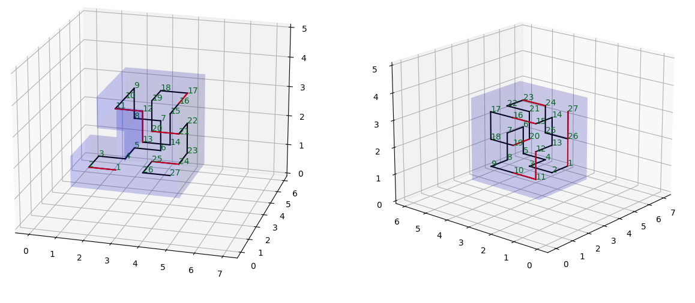
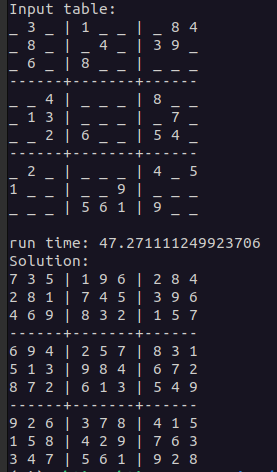
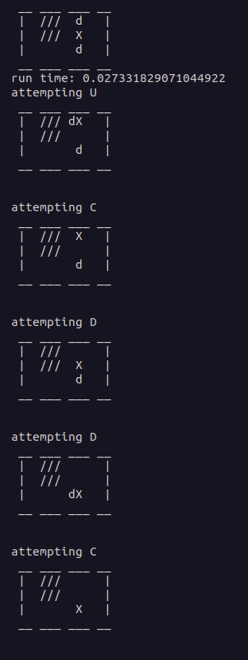

 **[Snake Cube Solver](./SnakeCube/)**

A classical AI project focused on efficiently solving the Snake Cube puzzle using the A* search algorithm. The project aims to develop an intelligent solver by modeling the puzzle as a graph and utilizing the A* algorithm to explore the state space systematically. The heuristic function estimates the minimum moves required to reach the goal state, while the cost function evaluates cumulative costs. The AI system is evaluated using various puzzles, demonstrating its ability to consistently find optimal solutions within a reasonable time frame, outperforming traditional methods. 

#

 **[Sudoku Solver](./Sudoku/)**

This project that tackles the challenge of solving Sudoku puzzles using the Simulated Annealing algorithm. By viewing the puzzle as a constraint satisfaction problem, the algorithm aims to iteratively improve candidate solutions by accepting probabilistic moves based on a temperature schedule. 

#

 **[Vacuum Cleaner](./VacuumCleaner/)**

The Vacuum Cleaner Problem involves designing an intelligent agent capable of cleaning a set of rooms efficiently and thoroughly. The project proposes employing the BFS algorithm, a blind search technique, to explore the state space systematically by expanding all possible actions at each depth level. The agent's goal is to find the shortest path that covers all the dirty rooms. The Vacuum Cleaner Problem is modeled as a graph, with rooms representing nodes and transitions between rooms as edges. The BFS algorithm effectively traverses the graph, ensuring optimal cleaning paths. 
