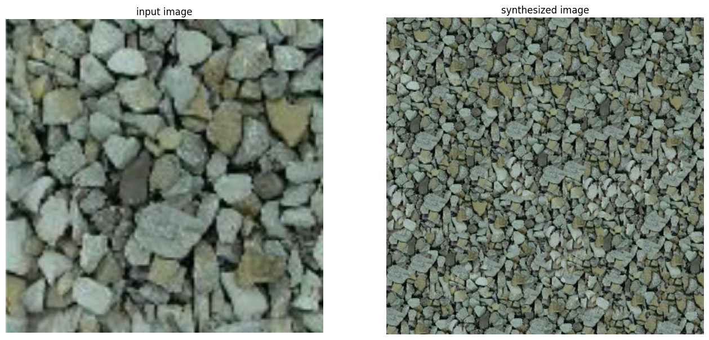

 **[Image Quilting with Min Cut](./Image_Quilting.ipynb)**

In this project, we implement an image quilting technique enhanced with the minimum cut algorithm to achieve seamless and coherent texture synthesis. Image quilting involves stitching together smaller image patches to create larger textures. By integrating the minimum cut algorithm, we aim to minimize visible artifacts and improve the quality of the synthesized textures at patch boundaries. 

#

 **[Traditional Fingerprint Classification](./Fingerprint.ipynb)**

In this project, a classification algorithm for classifying fingerprint images into 5 different group using only traditional image processing methods is performed. The approach involves utilizing Histogram of Oriented Gradients (HOG) features extracted from the fingerprint images. The HOG technique captures and represents the local gradient information of the fingerprints, providing valuable insights into their distinctive patterns. Through the analysis of HOG features, the algorithm can effectively distinguish between various fingerprint categories.

#

 **[JPEG Compression Implementation](./Fingerprint.ipynb)**

In this project, a basic JPEG compression is implemented, which involves converting an input image into a compressed JPEG format. The process includes several key steps, such as color space conversion, chroma subsampling, discrete cosine transform (DCT), quantization, and lossless encoding. By reducing the spatial redundancy and utilizing quantization to discard less important image information, the compressed JPEG image can achieve significant file size reduction without causing a noticeable loss in visual quality. 

#

 **[Indexed Image](./Indexed_Image.ipynb)**

This project utilizes OpenCV to create a function that takes an image and the desired number of colors, returning a compressed version of the image with the specified color count. The k-means algorithm is used for color clustering, and the indexed images are displayed using the "applyColorMap" function. Experimenting with different color counts and color spaces, the results show reduced image clarity and detail, but varying color space choices can impact image quality.

#

 **[Gaussian Noise Removal](./Gaussian_Noise_Removal.ipynb)**

In this project using OpenCV, a program was developed to add Gaussian noise to three different images and then apply Gaussian filters of various kernel sizes to remove the noise and make the images smoother. Mean Square Error (MSE) and Peak Signal-to-Noise Ratio (PSNR) metrics were used to find the best parameter values for the filter's kernel size. The results showed that a balanced kernel size is required to retain image information while eliminating noise effectively. Additionally, varying sigma values for the Gaussian noise distribution affected the filter's performance in noise removal, and the relationship between noise level and optimal kernel size was not always linear for certain images.

#

 **[Cartoonization](./Cartoonization.ipynb)**

in This project, we read an image and converted it to RGB format, then applied Canny edge detection to extract the edges. This process involved Gaussian smoothing, gradient and direction calculation for each pixel, non-max suppression to reduce false edges, and thresholding to determine the presence of edges. Before using this method, images were converted to grayscale. Next, we applied a Gaussian filter to smooth the images and reduce the impact of edges. Finally, we combined the blurred images with the extracted edges to create the cartoonized image.

#

 **[Basic Face Cartoonization](./Basic_Cartoonization.ipynb)**

This project focuses on face detection using a Haar Cascade classifier in OpenCV. Once faces are detected in the images, the algorithm applies different spatial transformations to these faces to achieve a cartoonized effect. The transformations include rotations, resizing, shearing, perspective changes, and more. The final output shows the cartoonized versions of the detected faces.

#

 **[Hybrid Image](./Hybrid.ipynb)**

In the this project, I made a pipeline that inputs two images and produce a hybrid image or hybrid visual illusion by combining low-frequency and high-frequncy components from the images. This image when viewed from different distances, can be appeared as one of those original images.
Low-frequency components contains attributes such as overall shapes, contours, and global structures, which are perceived more readily when viewed from a distance. In contrast, high-frequency components, including fine details, textures, and local features, become more distinguishable when viewed up close.

