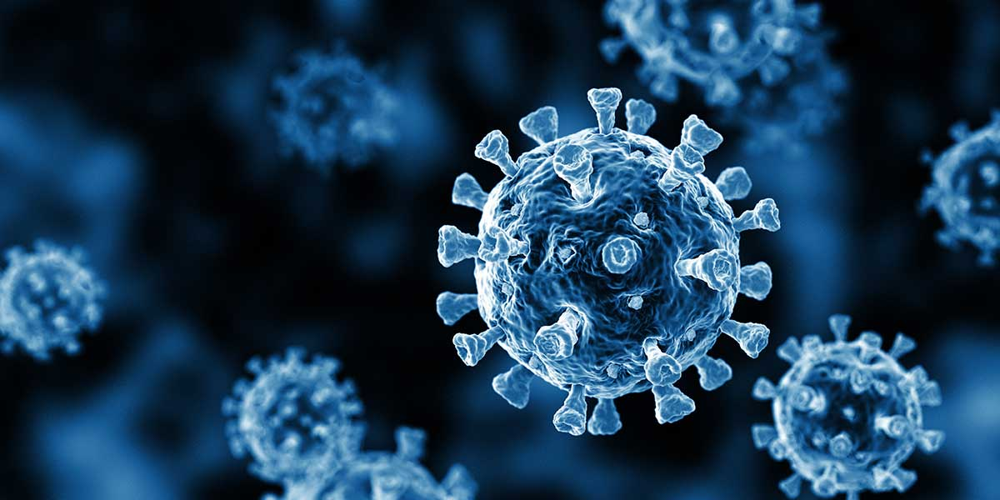

# Overview
Unfortunately, our lives have been deeply affected by the corona virus over these past two years. An important goal of data mining is to understand the patterns and trends in the data and extract knowledge and facts from the raw data. It is clear that with the proper analysis and insightful knowledge of the data, we can make better decisions and inform societeies so we can get past this pandemic.

In this project, correlations between features in the global COVID-19 dataset using visualisation techniques are exported and Exploratory data analysis, and data visualisation are performed on the data.

Tech: Python, Pandas, Matplotlib, Seaborn

# Methodology
- Data Exploration
- Data Preprocessing
- Exploratory Visualization

# Results
The most important and valuables conclusions that gathered during the processes which were discussed in the report, are listed as follows:

- Confirmed cases and deaths are positively correlated. Europe has the highest total number of cases and deaths in this period. Number of cases and deaths depends on location for instance South American countries have the highest rate of death per case and highest rate of positive tests; therefore, South America has the worst situation in dealing with this virus among the other continents.
- ICU and hospital patients are positively correlated. Europe has the highest number of ICU and hospital patients. Number of patients is depended on location for example North American countries have the highest rate of ICU per hospital patient.
- Confirmed cases, deaths and patients are positively correlated to each other.
- Vaccination is negatively correlated to these variables which means that with increasing number of vaccinations in most countries, number of new cases, deaths, and patients decrease.
- Stringency index is negatively correlated to these variables which means that with increasing stringency in most countries, number of new cases, deaths, and patients decrease.

# Credits
- [Dataset by OWID](https://github.com/owid/covid-19-data/tree/master/public/data)
- [Final Reprot](report.pdf)