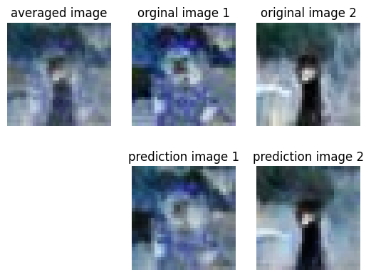

 **[Image Retrieval Using UNet](./Image%20Retrieval%20Using%20UNet/)**

In this project, I created a UNet-based Auto-encoder capable of producing original images by giving their averaged image as its input. the tasks involved are the following:
1. Selecting 1,000 images form original dataset stratified to their label. Make train and test set from these images.
2. Make a proper input-output pipeline in order to train the model.
3. Come-up with an architecture which could extract the most important features form the input images, and decode those features into their original images.
4. Modify the loss function, optimizer and tune the learning rate.
5. Calculate the performance of the final model on train and test set and visualize them.

#

 **[Intel Image Classification - Transfer Learning](./Intel%20Image%20Classification/)**

The project involves image classification using transfer learning with various pre-trained models in PyTorch. The dataset, obtained from Kaggle, consists of 14,000 training records and 3,000 test records, belonging to 6 different classes. The images were resized, normalized, and transformed into Torch tensors. Different pre-trained models, including EfficientNet, ResNet50, ResNext50, Wide ResNet 50, DenseNet 161, Vision Transformer (ViT), and InceptionV3, were experimented with. ViT with a custom classifier showed the best performance, achieving the highest accuracy and overcoming the issue of misclassifying mountain and glacier images that other models encountered. The ViT model demonstrated the ability to extract valuable features for the dataset, outperforming the other architectures.

#

 **[CIFAR-10 Classification](./CIFAR-10/)**

This project involves image classification using Convolutional Neural Networks (CNN) on the CIFAR-10 dataset. Various experiments with different CNN architectures are performed, exploring the effects of neural network depth, number of neurons in hidden layers, and batch normalization. The optimum model with appropriate depth, neuron numbers, and batch normalization achieves the highest accuracy, F1-score, precision, and recall among all tested architectures.

#

 **[Fashion MNIST Classification](./Fashion%20MNIST/)**

This project involves classification using Multi-Layer Perceptrons (MLP) on the Fashion MNIST dataset. The dataset consists of 60,000 training records and 10,000 test records, each representing grayscale images of size 28 * 28 pixels belonging to one of the ten classes. Several experiments are conducted to analyze the effects of neural network depth, the number of neurons in hidden layers, dropout layers, early stopping, batch normalization, and regularization on the model's performance. The shallow network with 3 linear layers and 50 neurons in each hidden layer achieves the best performance on the test data, while the deepest model with 8 linear layers and 10 neurons performs the least effectively.

#

 **[Dogs Vs. Cats Classification](./Dogs_vs_Cats.ipynb)**

Performance comparison of VGG16 and ResNet50 on Dogs vs. Cats dataset, achieving 98% accuracy on the test data using learning rate schedulers and data augmentation. Tech: Python, TensorFlow, Keras (Computer Vision, CNN, Transfer learning)

#

 **[Digit Recognizer (MNIST)](./Digit_Recognizer.ipynb)**

Fitting deep CNN on MNIST dataset, achieving 99% accuracy on the test data (Top 11% solution on Kaggle) using batch normalization, data augmentation, and learning rate scheduling. Tech: Python, TensorFlow, Keras (Computer Vision, CNN)