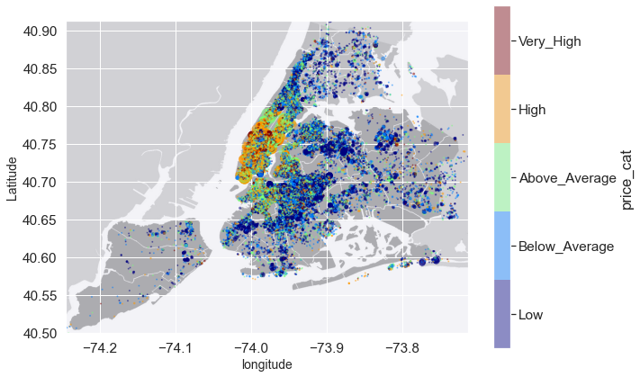

# Overview
Performing statistical tests, Exploratory data analysis, and data visualisation on Airbnb dataset. 

Tech: Python, Pandas, Matplotlib, Seaborn, SciPy

# Methodology
- Data Exploration
- Data Preprocessing
- Exploratory Visualization
- Statistical Tests and Analysis

# Results
The most important and valuables conclusions that gathered during the processes which were discussed in the report, are listed as follows:
- The neighbourhoods in this city can be divided into two groups. First group is the crowded and the rich one which consists of rooms with high prices. Manhattan and Brooklyn are placed in this group. The second group is the uncrowded and the poorest one compare to the first group which the majority of rooms that are located in this group are around average or below it. Staten Island, Bronx, and Queens are placed in this group.
- First group (crowded neighbourhoods) have the wider range of room type, price, and minimum night compare to second group. This is probably because of large population who live in the first group which have increased demand for different type of room with different amount of time and different prices. In other words, in first group neighbourhoods, customers can find the desired room that they want easily and faster compare to the second group, and that is why the majority of people are living in the first group neighbourhoods.
- Availability during a year is dependent on type of room, price, and neighbourhood group. Mainly, rooms which located in first neighbourhood group are less available compare to the second group, which is probably because of the majority of people and huge of amount of demand for living in this group. Moreover, rooms with high prices are more available during a year, because the minority of people can pay for these kinds of rooms and demand for this type of rooms are less than other ones. Also, shared room are much more available during a year compare to private rooms or entire apartments or homes due to low frequency and lack of demand for this kind of rooms in the city.
- Price is also dependent on type of room. Usually, price of entire apartment or home is more expensive than private or shared rooms.

# Credits
- [Dataset on Kaggle](https://www.kaggle.com/datasets/dgomonov/new-york-city-airbnb-open-data)
- [Final Reprot](report.pdf)