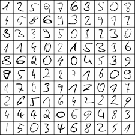

# Data Science Portfolio
Repository containing portfolio of data science projects completed by me for academic, self learning, and hobby purposes Using Python and iPython notebooks.

Tools
  - **Python**: NumPy, Pandas, Seaborn, Matplotlib, SciPy
  - **Machine Learning and Deep Learning**: scikit-learn, TensorFlow, keras, Imblearn, Dask

# Contents
 ## Machine Learning

  **[Spotify Music Recommander System](https://github.com/Abtinmy/data-science-portfolio/tree/main/Spotify%20Music%20Recommander)**

 Creating a music genre classifier, and Performing different clustering algorithms on Spotify music dataset on Kaggle. Using user-generated data by calling Spotify API and recommand a playlist generated by calculating the distance of user preferences and the clusters. (Clustering Algorithms, Classification, API Calling, Dimensionality Reduction)

 #

  **[TalkingData AdTracking Fraud Detection](https://github.com/Abtinmy/data-science-portfolio/tree/main/TalkingData%20AdTracking%20Fraud%20Detection)**

 Tackle imbalanced data classification task using different oversampling, under-sampling, and weight-based methods. Comparing different classification algorithms on the data. (Imbalanced Data, Classification, Dimensionality Reduction)

  
 
 #

  **[Mobile Price Classification](https://github.com/Abtinmy/data-science-portfolio/tree/main/Mobile%20Price%20Classification)**

 This project gives an overview of the various machine learning algorithms implemented to classify price range of a mobile device based on different features that a mobile has. Exploratory data analysis was performed on the dataset in order to take insights from the data. Feature selection and feature extraction was performed using different machine learning algorithms with the help of Scikit-learn package, and various machine learning models was used to build supervised learning multi-class classifiers, that provided an accuracy of 97% on the test dataset.

 #

  **[Apartment Rental Price Prediction in Germany](https://github.com/Abtinmy/data-science-portfolio/tree/main/Apartment%20Rental%20Price%20Prediction%20in%20Germany)**

 This project gives an overview of the various machine learning algorithms implemented to predict rental price of an apartment based on different features that a rental offer has. Exploratory data analysis was performed on the dataset in order to take insights from the data. Feature selection and feature extraction was performed using different machine learning algorithms with the help of Scikit-learn package, and various machine learning models was used to build supervised learning regression, that provided a root mean squared error of 149.33 on the test dataset, which is an acceptable amount of error according to the rental price range.

 

 ## Deep Learning

  **[Dogs vs. Cats image classifier](https://github.com/Abtinmy/data-science-portfolio/blob/main/Dogs_vs_Cats.ipynb)**

 Performance comparison of VGG16 and ResNet50 on Dogs vs. Cats dataset, achieving 98% accuracy on the test data using learning rate schedulers and data augmentation. Tech: Python, TensorFlow, Keras (Computer Vision, CNN, Transfer learning)

 

 #

  **[Digit Recognizer](https://github.com/Abtinmy/data-science-portfolio/blob/main/Digit_Recognizer.ipynb)**

 Fitting deep CNN on MNIST dataset, achieving 99% accuracy on the test data (Top 11% solution on Kaggle) using batch normalization, data augmentation, and learning rate scheduling. Tech: Python, TensorFlow, Keras (Computer Vision, CNN)

 

 ## Data Analysis and Visualization 
 

  **[Data Analysis on COVID-19 dataset by OWID](https://github.com/Abtinmy/data-science-portfolio/tree/main/COVID-19%20Data%20Analysis)**

 In this project, correlations between features in the global COVID-19 dataset using visualisation techniques are exported and Exploratory data analysis, and data visualisation are performed on the data. (EDA, Data Visualisation, Data cleaning)

 

 #

  **[Data Analysis on Airbnb NYC dataset](https://github.com/Abtinmy/data-science-portfolio/tree/main/New%20York%20City%20Airbnb%20Data%20Analysis)**

 Performing statistical tests, Exploratory data analysis, and data visualisation on Airbnb dataset. Data Exploration, Preprocessing, and various statistical tests were performed on the data and most important results were reported.  (EDA, Data Visualisation, Data Cleaning, Statistical Analysis)

 

 #

  **[Data Analysis on Louisville Crime Reports dataset](https://github.com/Abtinmy/data-science-portfolio/tree/main/Louisville%20Crime%20Reports%20Analysis)**

 Performing statistical tests, Exploratory data analysis, and data visualisation on crime reports from Louisville goverment. (EDA, Data Visualisation, Data Cleaning, Statistical Analysis)

 
 

 ## Projects 
 
  **[Machine Learning Cloud Services](https://github.com/Abtinmy/data-science-portfolio/tree/main/Machine%20Learning%20Cloud%20Services)**

 In this project, 4 different machine learning services including time series interpolation, date format transformation, outlier detection, and imbalanced data management service are implemented using various methods. (Data preprocessing methods, Imbalanced data, Interpolation, outlier detection)
