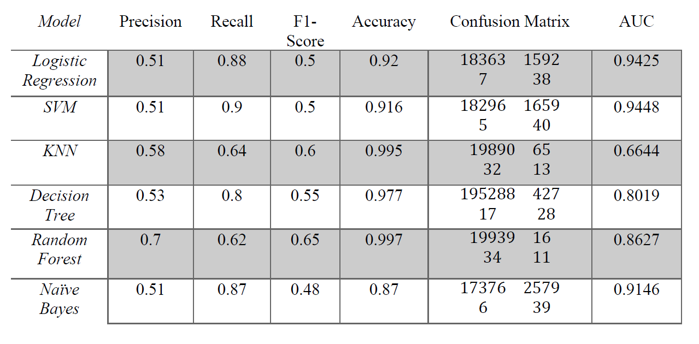

# Overview
Tackle imbalanced data classification task using different oversampling, under-sampling, and weight-based methods. Comparing different classification algorithms on the data.
 
Tech: Python, Scikit-Learn, Imblearn, Pandas, Matplotlib, Seaborn

# Methodology
In this project, I preform different classification methods in order to predict whether an app will be downloaded after clicking on a mobile app advertisement using ‘TalkingData adtracking fraud detection’ dataset. At the end, classification report, ROC curve, and decision boundaries for each classifier will be reported.

- Data Exploration
- Metrics
- Data Preprocessing
- Performing classification techniques
    - Logistic Regression
    - SVM
    - KNN
    - Decision Tree
    - Random Forest
    - Naive Bayes

# Results

# Credits
- [Dataset on Kaggle](https://www.kaggle.com/c/talkingdata-adtracking-fraud-detection/data)
- [Final Reprot](report-fraud-detection.pdf)